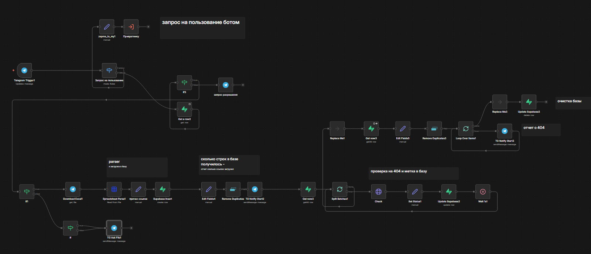

# Telegram 404-Link Checker (n8n + Supabase)

Автоматизированный инструмент для массовой проверки веб-ссылок на наличие ошибки 404 («Страница не найдена»). Управление осуществляется полностью через Telegram-бота.
**Для чего использую лично я**: как контекстолог периодически проверяю РК на битые ссылки. Выгружаю все уникальные ссылки их компаний и прогоняю их через бота 404. Получаю на выходе - все ок или список ссылок, которые вылаи 404 ошибку - иду в РК и отключаю объявления или меняю ссылки на реально действующие.

## 🎯 Цель проекта
Обеспечить быстрый и удобный способ аудита больших списков URL-адресов без использования сложных SEO-комбайнов или ручной проверки. Бот позволяет загрузить файл со ссылками и получить отчет о «битых» ресурсах прямо в мессенджер.

## 👨‍💼 Для кого
- SEO-специалисты: Для регулярного аудита сайтов на наличие битых внутренних и внешних ссылок.
- Маркетологи: Для проверки ссылок в рекламных кампаниях перед запуском или после обновления структуры сайта.
- Контент-менеджеры: Для контроля актуальности ссылок в старых статьях и каталогах.
- Веб-мастера: Для мониторинга состояния ссылочной массы на клиентских проектах.

## Схема workflow

## 🚀 Основные возможности
### 1. Массовая проверка. Обработка списков ссылок через загрузку .xlsx файлов.
### 2. Система контроля доступа («Привратник») - не обязательно! Можно вырезать этот блок: соедините Телеграм Trigger с If1.
Встроенная проверка прав пользователей через базу данных. Новые пользователи должны отправить запрос на доступ.
### 3. Оптимизация нагрузки
Использование метода HEAD вместо GET позволяет проверять ссылки мгновенно, не скачивая содержимое страниц.
### 4. Автоматизация на n8n
Легко масштабируемая логика, не требующая написания сложного бэкенда.
### 5. Временное хранение данных в Supabase. Результаты логируются во время процесса и по окончании - уничтожаются.
Можно масштабировать до построения отчета который скачивается в ТГ или логируется в базе.

## 🛠 Технологический стек
- n8n: Оркестрация логики и автоматизация процессов.
- Telegram Bot API: Интерфейс взаимодействия с пользователем.
- Supabase (PostgreSQL): Хранение очереди ссылок, статусов проверки и белого списка пользователей.
- HTTP Request (HEAD method): Проверка статус-кодов серверов.
  
  
## 📈 Как это работает (Workflow)
1. Авторизация: Бот проверяет, есть ли ID пользователя в списке одобренных в Supabase.
2. Загрузка: Пользователь отправляет Excel-файл. Бот парсит колонку А с URL-адресами.
3. Очередь: Ссылки сохраняются в базу со статусом now.
4. Проверка: n8n берет ссылки пачками по 10 штук, опрашивает серверы и записывает результат (200 OK, 404 Not Found и др.).
5. Результат: Бот присылает список всех найденных 404-ошибок пользователю.
6. Очистка: После завершения сессии временные данные удаляются из БД.
  
  
## 📞 Контакты
- **Вершинина Наталия** маркетолог и n8n-автоматизатор
- **Telegram:** @vershininanata
- **Email:** vertunatpr@yandex.ru
- **Локация:** Новосибирск, Россия

## 📝 Как использовать
1. Выберите интересующий кейс
2. Скачайте `workflow.json`
3. Импортируйте в свой n8n
4. Настройте credentials и параметры
5. Запускайте!

---
💡 Нужна кастомная автоматизация? Напишите мне!