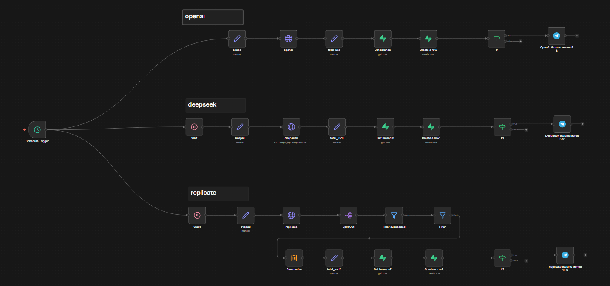

# AI Account Balance Monitor

Автоматический мониторинг баланса и расходов OpenAI, DeepSeek, Replicate. Ежедневно в 9:30 сохраняет метрики в Supabase, алертит в Telegram при низком балансе.

*(3 параллельные ветки: OpenAI/DeepSeek/Replicate)*

## Что делает

- **Расчет расходов вчера**: OpenAI (токены + перевод в деньги), DeepSeek (баланс), Replicate (predict_time * \$0.0007).
- **Сохранение**: Таблица `my_ai_many` (ai, date, total_usd, balance_usd).
- **Алерты**: Telegram если balance <5\$ (OpenAI/DeepSeek) или <10\$ (Replicate).
- **Частота**: Schedule 9:30 (Asia/Novosibirsk).


## Схема workflow




## Требования

| Сервис | Credentials |
| :-- | :-- |
| OpenAI | HTTP Header Auth |  |
| DeepSeek | HTTP Header Auth |  |
| Replicate | HTTP Header Auth |  |
| Supabase | Supabase API |  |
| Telegram | Telegram API |  |

## Установка

1. Импорт JSON в n8n.
2. Создайте credentials (см. README шаблоны).
3. Замените `YOUR_CHAT_ID` в Telegram нодах.
4. Создайте таблицу Supabase:

```sql
CREATE TABLE my_ai_many (
  id SERIAL PRIMARY KEY,
  ai TEXT,
  date TEXT,
  total_usd DECIMAL,
  balance_usd DECIMAL,
  created_at TIMESTAMP DEFAULT NOW()
);
```

5. Активируйте workflow.

## Цены (адаптируйте)

```
OpenAI: input 0.00000015$/tok + output 0.0000006$/tok (gpt-4o-mini)
DeepSeek: API balance delta
Replicate: predict_time * 0.0007$/s
```


## Лимиты алертов

- OpenAI/DeepSeek: < \$5
- Replicate: < \$10

**Тестировано n8n 2.4.4.** Лицензия MIT. [n8n docs](https://docs.n8n.io)


## Topics / Ключевые слова
- ai-monitoring
- openai
- deepseek
- replicate
- balance-monitor
- cost-tracking