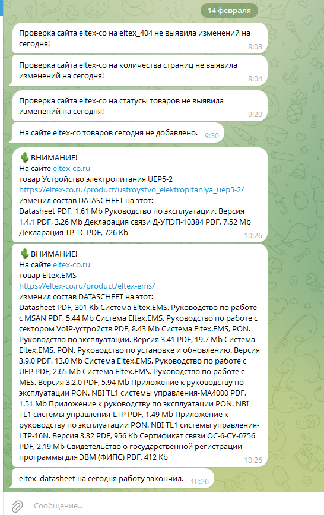
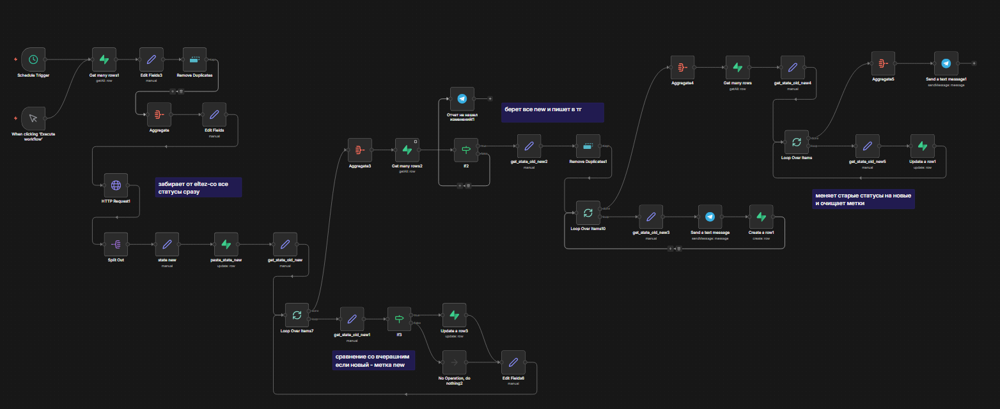

# Процесс автоматизации мониторинга состояний товаров на сайте Eltex-co.ru

## Описание Workflow

**Eltex State Workflow** — автоматизация мониторинга состояний товаров на сайте eltex-co.ru для дилеров. Получает данные из API Eltex, сравнивает статусы товаров, логирует изменения в Supabase, уведомляет в Telegram при изменениях. Триггеры: Manual и Schedule (09:20).

## Этот рабочий процесс - небольшая часть работы по глобальному отслеживанию изменений на сайте eltex-co. 
В ежедневном рабочем процессе участуют несколько проверок: на количество товаров в каталоге, на ответ страниц кодом 404, на изменение состава datdscheet, на изменение количества товаров в разделах сайта. Для официального дилера крайне важно отслеживать ряд маркеров, чтобы своевременно менять информацию на своем сайте. При помощи этого процесса сотрудники официального дилера сэкономили около 20 рабочих часов в месяц. Теперь не нужно вручную проверять данные, бот оповестить утром, если есть изменения.

## Схема workflow

## Цель

- Отслеживание статусов товаров Eltex.
- Автоматическое обновление БД Supabase.
- Уведомления в Telegram о смене статуса.

## Установка

1. Импортируйте `workflow.json` в n8n v2.4.4+.
2. Настройте Credentials.
3. Активируйте Schedule Trigger или Manual Execute.

## Схема workflow

## Требуемые API Ключи
- Supabase
- Telegram
- Eltex API (открытые данные)

## Настройки Таблиц Supabase

### Таблица `eltex_razdely_tovary`

| Поле | Тип | Описание | Использование |
| :-- | :-- | :-- | :-- |
| `id` | number | PK | Фильтр/UPDATE |
| `product_id` | number | ID товара Eltex | Compare, Filter |
| `current_status` | string | Текущий статус (old/new) | Сравнение old≠new |
| `currient_state_state` | string | Состояние ('new') | Фильтр для обработки |
| `current_status_old`? | string | Старый статус | Set нода |
| `current_status_new` | string | Новый статус из API | Set/UPDATE |

### Таблица `eltex_history`

- **Операции**: Insert (Create row).
- **Поля для Insert**:

| Поле | Значение | Тип | Описание |
| :-- | :-- | :-- | :-- |
| `message` | `eltex-co.ru {{product_name}} {{product_url}} {{current_status_new}}` | string | Лог изменения |
| `created_at` | `now().format('yyyy-MM-dd')` | date | Дата логирования |
| `workflow` | `'eltex_state'` | string | Имя workflow |

**Rls/Политики**: Убедитесь, что Supabase Credentials имеют права SELECT/INSERT/UPDATE. Используйте Row Level Security для prod.[^1]

## Архитектура (Ключевые Узлы)

- **Триггеры**: ManualTrigger, ScheduleTrigger (09:20).
- **Логика**: SplitInBatches → IF (old ≠ new) → HTTP Eltex API → Set states → Supabase ops → Telegram.
- **Sticky Notes**: Указывают на lifecycle, API calls, Supabase updates.
