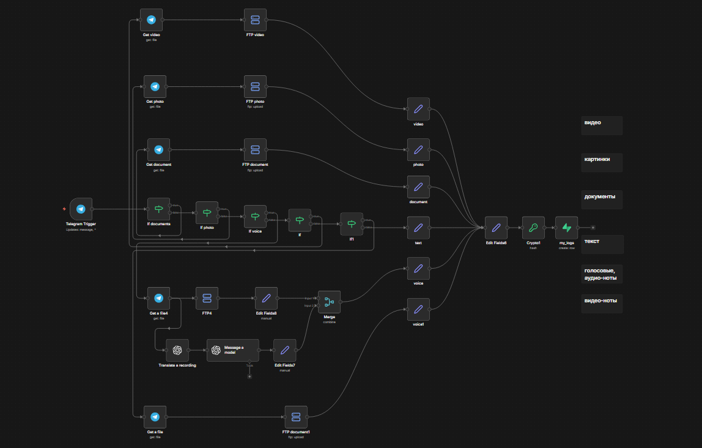

# Процесс логирования переписок в Telegram

Автоматическое логирование **ВСЕХ** сообщений Telegram-бота в Supabase + FTP. Фиксирует текст, фото, видео, голосовые (с переводом в текст), документы. **Proof-of-concept** для бизнеса: условия сделок, договоренности — сохраняются **доказуемо** даже при удалении в TG.

## 🎯 Для Кого

**ЦА: Бизнесмены, самозанятые, фрилансеры**

- Фиксируйте устные договоренности/условия сделок.
- **Судодоказуемо**: SHA256-хэш (chat_id+user_id+message) + timestamp.
- Даже если клиент удалит сообщение в TG — **у вас есть доказательство**.
- Идеально для: продажи услуг, договоров, тендеров, чатов с партнерами.

**Пример**: Клиент сказал "оплата 50% предоплата" в голосовом → лог с транскриптом + хэш → суд при споре.


## Схема workflow



## 🚀 Установка (5 мин)

1. Импортируйте `my_logs_workflow_clean.json` в **n8n v2.4.4+**.
2. Настройте **Credentials**:

| Сервис | Credential | Требования |
| :-- | :-- | :-- |
| Telegram | `YOUR_bot_for_logs` | Bot Token (BotFather) |
| Supabase | `Supabase account` | URL + Anon Key |
| OpenAI | `YOUR_open_ai` | GPT-4o-mini API Key |
| FTP | `FTP account` | Хост/логин/пароль для `/my_logs/` |

3. Создайте таблицу `my_logs` в Supabase:
4. Активируйте workflow.

## 🗄️ Таблица Supabase `my_logs`

```sql
CREATE TABLE my_logs (
  id BIGSERIAL PRIMARY KEY,
  chat_id BIGINT NOT NULL,      -- ID чата TG
  username TEXT,                -- @username отправителя
  name TEXT,                    -- Имя Фамилия
  message TEXT NOT NULL,        -- Текст/транскрипт/ссылка на файл
  proof_hash TEXT UNIQUE NOT NULL, -- SHA256(chat_id+user_id+message)
  created_at TIMESTAMPTZ DEFAULT NOW()
);
```

**Индексы**:

```sql
CREATE INDEX idx_chat_id ON my_logs(chat_id);
CREATE INDEX idx_proof_hash ON my_logs(proof_hash);
CREATE INDEX idx_created_at ON my_logs(created_at);
```


## 🔍 Что Логирует

| Тип | Обработка | Хранение |
| :-- | :-- | :-- |
| **Текст** | As-is | `message` |
| **Фото** | Скачивает → FTP `/my_logs/` | Ссылка `{{YOUR_DOMAIN}}/logs/file.jpg` |
| **Документ** | Скачивает → FTP | Ссылка на файл |
| **Голосовое** | OpenAI → текст + FTP | Транскрипт + ссылка |
| **Видео/Видео-ноты** | Скачивает → FTP | Ссылка |
| **Все** | SHA256 хэш уникальности | `proof_hash` для суда |

## 🎛️ Архитектура

```
Telegram Trigger → IF (photo/doc/voice/video/text)
                 ↓
Get File → FTP Upload → Set (chat_id+message+link)
                 ↓
Crypto SHA256 → Supabase my_logs
```

**Sticky Notes** в workflow описывают ветки.

## ⚖️ Юридическая Защита

1. **Хэш**: Невозможно подделать/изменить без нарушения SHA256.
2. **Timestamp**: Supabase фиксирует время.
3. **Полный контекст**: chat_id, username, name — кто/когда.
4. **Файлы**: FTP бэкап — оригиналы не потеряются.

**Пример лога**:

```
chat_id: 123456789
username: @client
name: Иван Петров
message: "Соглашаюсь на 100к предоплата"
proof_hash: "abc123def...base64"
```

## 📱 Использование

1. Направьте бота в канал/чат.
2. **Все сообщения** логируются автоматически.
3. Экспорт из Supabase: `SELECT * FROM my_logs WHERE chat_id=123 ORDER BY created_at;`.


## PS: Можно еще усилить при желании! 

### 🔗 Цепочка блоков (Hash Chaining) — связь строк

Идея: Каждое новое сообщение содержит хэш предыдущей строки. Удалить/изменить отдельную строку = поломка всей цепочки после.
-- **Полная верификация БЛОКЧЕЙНА**

Пример:

- **Строка 1**: chain_hash = "chat1+msg1+genesis"
- **Строка 2**: chain_hash = "chat2+msg2+chain_hash1" 
- **Строка 3**: chain_hash = "chat3+msg3+chain_hash2" ✅
Удалить строку 2 → chain_hash3 ломается → **ВСЕ ясно**.


## 📞 Контакты
- **Вершинина Наталия** маркетолог и n8n-автоматизатор
- **Telegram:** @vershininanata
- **Email:** vertunatpr@yandex.ru
- **Локация:** Новосибирск, Россия

## Topics / Ключевые слова
- n8n 2.4.4
- telegram-bot
- telegram-logger
- telegram-api
- chat-logging
- message-logger
- n8n-workflow
- telegram-n8n
- supabase
- postgresql-logging
- automation
- chatbot